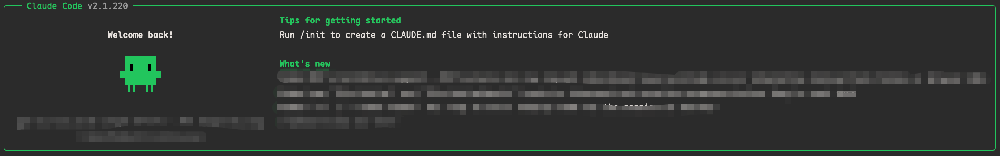
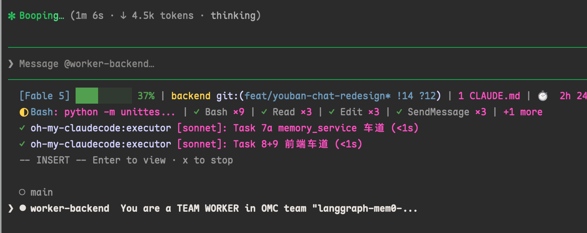

# ClawGod Plus

**English** | [简体中文](README.md) | [日本語](README_JP.md)

> A maintained, enhanced branch of [0Chencc/clawgod](https://github.com/0Chencc/clawgod), built on the official Claude Code runtime rather than replacing it with a third-party client.

ClawGod Plus extracts the JavaScript embedded in Claude Code's Bun standalone binary, applies a version-tolerant patch set, and runs the patched CLI under Bun. This branch keeps every upstream capability while adding browser, Computer Use, context-window, claude-mem, worker-runtime, and regression-testing improvements.



## Features

| Feature | Description |
|---|---|
| **claude-mem compatibility** | Reuses the configured ClawGod Plus provider for claude-mem without copying credentials into its `.env`; backs up managed settings, respects later user edits, restarts the worker, cleans stale Chroma processes, and restores settings on uninstall. |
| **Claude in Chrome for API-key mode** | Uses the local Chrome extension socket or named pipe without requiring the OAuth subscription bridge; preserves `--chrome` and `--no-chrome` through agent dispatch. |
| **Computer Use by default** | Externalizes the feature gate, enables Computer Use by default, and makes it available to noninteractive workers such as cmux and stream-json sessions. Automatic `--chrome` injection is suppressed for machine-oriented commands, preventing repeated blank tabs. |
| **Configurable context limit** | Replaces the hardcoded local 200K fallback with `CLAUDE_CODE_CONTEXT_LIMIT`, then `CLAUDE_CODE_MAX_CONTEXT_TOKENS`, then 200K. Includes check and restore modes. |
| **Bun and worker-runtime hardening** | Targets old and new minified worker resolver shapes while preserving Bun's shared standalone-executable semantics, so daemon, fork, MCP, and background worker paths do not break each other. |
| **Installer and runtime reliability** | Adds `--no-upgrade` control-flow coverage, local-installer update routing, macOS TIFF clipboard-path recognition, broader CI triggers, and isolated regression fixtures for patch drift. |

### Attribution for integrated patch work

The standalone `apply-claude-code-*` scripts, their archives, and the patch approaches integrated from them are the work of **哈雷佬**. This branch packages and hardens that work inside the Unix and Windows installers; integration does not change the original authorship.

The relevant source files are:

- [`apply-claude-code-chrome-fix.sh`](apply-claude-code-chrome-fix.sh) and [`apply-claude-code-chrome-fix.ps1`](apply-claude-code-chrome-fix.ps1)
- [`apply-claude-code-computer-use-fix.sh`](apply-claude-code-computer-use-fix.sh)
- [`apply-claude-code-context-limit-patch/`](apply-claude-code-context-limit-patch/)

## Complete capability set

The enhanced branch retains the full upstream patch set:

| Area | Capabilities |
|---|---|
| **Feature unlocks** | Internal User mode and hidden commands, GrowthBook overrides, Agent Teams, shared collaboration, Harbor Kite settings, and `/peers`, Computer Use, Auto-mode, Ultraplan, and Ultrareview. |
| **Restriction removal** | Removes `CYBER_RISK_INSTRUCTION`, URL-guessing restrictions, forced cautious-action confirmation, and the startup login notice. |
| **Provider support** | Anthropic API keys, OAuth, Anthropic-compatible endpoints, OpenAI-compatible gateways, provider import, and third-party prompt-cache header handling. |
| **Reliability** | Restored Glob/Grep tools, 1-hour prompt-cache allowlisting, auto re-patch after Claude upgrades, update notices, and three-level Lean Settings. |
| **Visual identity** | Green patched theme and message visibility fixes for non-Anthropic providers. |

## Prerequisites

ClawGod Plus has one installed JavaScript runtime prerequisite: **Bun 1.3.14 or newer**. The installer and every standalone patch tool run under Bun.

Use Shell as the operating-system command entry point on macOS/Linux, and PowerShell on Windows. Shell and PowerShell are command entry points, not additional JavaScript runtimes.

The installer fetches the current platform-specific official `@anthropic-ai/claude-code-<platform>` package from the npm Registry, then downloads and verifies its privately managed **ripgrep 15.2.0**. Do not install Claude Code, Node.js, npm, or a system ripgrep first.

## Install ClawGod Plus

These commands download the pinned ClawGod Plus release assets (v2026.8.13-claude.2.1.231).

**macOS / Linux**

```bash
curl -fsSL https://github.com/A6083450/clawgod-plus/releases/download/v2026.8.13-claude.2.1.231/install.sh | bash
```

**Windows PowerShell**

```powershell
irm https://github.com/A6083450/clawgod-plus/releases/download/v2026.8.13-claude.2.1.231/install.ps1 | iex
```

Useful installer options (with no version specified, the installer keeps the currently installed Claude Code version; a fresh install pulls the latest):

```bash
bash install.sh --version 2.1.220  # install a specific Claude Code version
bash install.sh --version latest   # explicitly upgrade to the latest
bash install.sh --no-upgrade      # re-patch the currently extracted version
bash install.sh --lean-on         # reduce unused tool definitions
bash install.sh --lean-max        # aggressive token reduction
bash install.sh --lean-off        # restore the full tool set; default
```

Green branding means the patched runtime is active. The original command is backed up before replacement.

## Optional enhancements

ClawGod Plus offers 13 optional enhancements, all enabled by default. The enhancement IDs are stable and ordered as follows:

| Kind | Enhancement ID |
|---|---|
| Patch | `chrome`, `computer-use`, `agents`, `planning`, `voice`, `auto-mode`, `unrestricted-tools`, `paste-images`, `privacy`, `branding` |
| Plugin | `claude-hud`, `claude-mem`, `superpowers` |

With no option and no interactive terminal (piped installs, CI, `claude update`), all 13 enhancements are enabled by default. The selection is persisted as strict JSON in `~/.clawgod/enhancements.json`:

```json
{
  "schemaVersion": 1,
  "mode": "all",
  "enabled": []
}
```

`mode` `all` always enables every enhancement in the manifest (including future IDs); `mode` `custom` enables only the IDs listed in `enabled`.

Running the installer directly in a terminal asks automatically, no flags to remember:

```
  ClawGod Plus 增强选择
   1) 全部 13 项增强（默认，回车即选）
   2) 仅核心（不装任何增强）
   3) 自定义菜单（逐项勾选）
   回车 全部增强 · Esc 退出
```

The custom menu is keyboard-driven: `↑`/`↓` move the cursor (wrapping at the ends), `Space` toggles the item, `Enter` confirms, `Esc` returns to the mode menu. Confirming with everything unchecked equals core-only. Pressing `Esc` at the top level cancels the install.

You can also choose explicitly or specify non-interactively:

```bash
bash install.sh --choose-enhancements   # open the per-item custom menu directly
bash install.sh --enhancements chrome,computer-use,claude-hud
bash install.sh --enhancements none   # core only, no enhancements
```

Windows PowerShell equivalents:

```powershell
.\install.ps1 -ChooseEnhancements
.\install.ps1 -Enhancements chrome,computer-use,claude-hud
.\install.ps1 -Enhancements none
```

A later `claude update` reuses the saved selection from `~/.clawgod/enhancements.json` and never prompts. Disabling `claude-hud` or `claude-mem` restores the configuration ClawGod owns, while disabling `superpowers` only stops management and never deletes the plugin you installed.

## Commands and launch behavior

```bash
claude              # patched Claude Code; interactive starts default to --chrome
clawgod             # explicit patched entry point
claude.orig         # original unpatched command backup
```

Interactive launches receive `--chrome` by default. Automatic injection is skipped for help, version, update, auth, config, MCP, daemon, print, permission, and structured input/output modes. An explicit `--chrome` argument is always preserved.

Disable automatic Chrome integration for one launch or shell:

```bash
CLAWGOD_NO_AUTO_CHROME=1 claude
```

## Recommended companion: Claude HUD

For ClawGod Plus multi-agent and long-running workflows, [Claude HUD](https://github.com/jarrodwatts/claude-hud) is the recommended statusline companion. It keeps model and context health, project and Git state, Claude configuration counts, usage, tools, agents, todos, cost, speed, and session duration visible without opening another window.

Every install and update automatically ensures these optional Claude Code plugin dependencies:

| Plugin | Canonical ID | Baseline |
|---|---|---|
| Claude HUD | `claude-hud@claude-hud` | `0.7.0` |
| claude-mem | `claude-mem@thedotmack` | `13.14.0` |
| Superpowers | `superpowers@superpowers-marketplace` | `6.2.0` |

ClawGod Plus installs a missing or older plugin at the baseline, but preserves any installed newer version. Public fixed archives are downloaded directly from GitHub and are accepted only after their exact byte length and fixed SHA-256 match. Bun remains the only installed JavaScript runtime dependency.

For HUD, the installer keeps the exact profile below and manages only the `statusLine` field in `~/.claude/settings.json`. That command invokes the managed `claude-hud-statusline.mjs` with the absolute Bun path; it does not add a Node or Bash status-line runtime. An optional plugin warning is reported without failing the core ClawGod Plus installation.

The screenshot below shows this recommended configuration during a multi-agent session.



Recommended `~/.claude/plugins/claude-hud/config.json`:

```json
{
  "language": "zh",
  "lineLayout": "compact",
  "pathLevels": 1,
  "elementOrder": ["project", "tools", "context", "usage", "memory", "environment", "agents", "todos", "sessionTime"],
  "gitStatus": {
    "enabled": true,
    "showDirty": true,
    "showAheadBehind": true,
    "showFileStats": true
  },
  "display": {
    "showModel": true,
    "showAddedDirs": true,
    "addedDirsLayout": "line",
    "showContextBar": true,
    "contextValue": "tokens",
    "showConfigCounts": true,
    "showCost": true,
    "showDuration": true,
    "showSpeed": true,
    "showUsage": true,
    "showTools": true,
    "showAgents": true,
    "showTodos": true,
    "showTokenBreakdown": true,
    "usageBarEnabled": true
  },
  "colors": {
    "context": "green",
    "usage": "brightBlue",
    "warning": "yellow",
    "usageWarning": "brightMagenta",
    "critical": "red",
    "model": "cyan",
    "project": "yellow",
    "git": "magenta",
    "gitBranch": "cyan",
    "label": "#ff4fc2",
    "custom": "#FF6600"
  }
}
```

## Claude in Chrome browser extension

[`claude-browser-1.0.77-patched.zip`](claude-browser-1.0.77-patched.zip) is the bundled **Claude in Chrome browser extension**, not a Claude Code plugin. It contains the patched Manifest V3 extension and the Unix/Windows `apply-claude-code-chrome-fix` scripts authored by **哈雷佬**.

1. Download and extract the ZIP.
2. Open `chrome://extensions` in Chrome and enable **Developer mode**.
3. Click **Load unpacked** and select the extracted `claude-browser-1.0.77-patched/` directory.

This patched extension requests broad browser permissions. Review the bundled source and use it only in environments where you are authorized to run it.

## Provider configuration

The first launch creates `~/.clawgod/provider.json`:

```json
{
  "apiKey": "sk-ant-...",
  "baseURL": "https://api.anthropic.com",
  "model": "",
  "smallModel": "",
  "timeoutMs": 3000000
}
```

- Set `apiKey` to bypass OAuth and use Anthropic or a compatible gateway.
- Leave `apiKey` empty to use `claude auth login` and the normal OAuth path.
- A non-Anthropic `baseURL` automatically configures compatible gateway auth and disables the per-request attribution header that can reduce prompt-cache hits.
- Existing `~/.claude` agents, skills, hooks, and MCP settings remain available.

## Configurable context window

Set the local fallback limit for a launch:

```bash
CLAUDE_CODE_CONTEXT_LIMIT=1000000 claude
```

Or make it persistent in `~/.claude/settings.json`:

```json
{
  "env": {
    "CLAUDE_CODE_CONTEXT_LIMIT": "1000000"
  }
}
```

This changes Claude Code's local 200K constants and checks. It does **not** bypass Anthropic billing, model capability, or first-party long-context eligibility.

## claude-mem compatibility

When claude-mem is installed and configured with the Claude provider, the installer can:

- run the selected claude-mem hooks and MCP entrypoints with Bun;
- reuse the active ClawGod Plus provider or Claude settings without writing credentials into claude-mem's `.env`;
- route claude-mem SDK subprocesses through a dedicated ClawGod Plus launcher;
- back up only the settings it manages and restore them during uninstall;
- avoid overwriting claude-mem settings changed manually after installation;
- clean duplicate stale Chroma MCP processes and restart the worker.

If claude-mem is absent, uses another provider, has no usable credential, or contains user-owned conflicting settings, the core ClawGod Plus installation continues without taking ownership of those settings.

Managed integration state is fail-closed. An unknown higher claude-mem ownership schema is preserved and reported as not Bun-verified; ClawGod Plus does not rewrite or delete it.

## Standalone patch tools

All tools in this section are authored by **哈雷佬** and are also integrated into the enhanced installer where applicable.

| Patch family | Unix | Windows | Check / restore |
|---|---|---|---|
| Claude in Chrome socket and subscription path | `apply-claude-code-chrome-fix.sh` | `apply-claude-code-chrome-fix.ps1` | `--check`, `--restore` |
| Computer Use settings and default-on gate | `apply-claude-code-computer-use-fix.sh` | Integrated installer path | `--check`, `--restore` |
| Configurable context limit | `apply-claude-code-context-limit-patch/apply-claude-code-context-limit-patch.sh` | `apply-claude-code-context-limit-patch/apply-claude-code-context-limit-patch.ps1` | `--check`, `--restore` |

Example read-only checks:

```bash
bash apply-claude-code-chrome-fix.sh --check
bash apply-claude-code-computer-use-fix.sh --check
bash apply-claude-code-context-limit-patch/apply-claude-code-context-limit-patch.sh --check
```

These scripts create backups before applying changes. Use their `--restore` option to revert the latest matching patch backup.

## How the installer works

1. Finds or downloads the platform-specific official Claude Code package.
2. Extracts the embedded JavaScript from the Mach-O, ELF, or PE Bun standalone binary.
3. Extracts embedded native `.node` modules into `~/.clawgod/vendor/`.
4. Rewrites Bun virtual paths to the extracted local modules.
5. Applies version-tolerant regex and AST-guided patches from the generated `patch.mjs`.
6. Applies the integrated Chrome, Computer Use, context-limit, worker, paste, provider, and feature patches.
7. Verifies that Bun can load the patched CLI.
8. Backs up the original launcher and writes `claude` plus `clawgod` launchers.
9. Uses the generated `plugin-dependencies.mjs` to ensure the three optional plugin baselines, then applies their managed HUD and claude-mem integrations.

`~/.clawgod/.source-version` records the patched native version. On later starts, the wrapper detects official Claude Code upgrades and re-patches the new binary.

The installer scripts are deterministic generated artifacts: `src/` is the single source of truth, and `dist/unix/install.sh` plus `dist/win/install.ps1` are generated by `bun build.mjs` — do not edit them by hand.

## Update

Use the normal command:

```bash
claude update
```

`claude update` is handed directly to the ClawGod updater by the wrapper and no longer depends on the upstream bundle's update action shape. If a new release only drifts on a mandatory bundle recognizer, the update commits a clean post-processed Claude Code runtime and shows a fallback warning; download, extract, vendor-publication, or Bun-load failures still roll back. Running the installer directly, first install, and `--no-upgrade` do not enable that degradation. Plugin baselines are managed separately: the update does not pin Claude Code to plugin versions.

```bash
claude update --version 2.1.220  # pin a known Claude Code version
claude update --no-upgrade      # reapply patches without downloading
```

## Uninstall

**macOS / Linux**

```bash
bash ~/.clawgod/install.sh --uninstall
hash -r
```

**Windows PowerShell**

```powershell
.\install.ps1 -Uninstall
```

Uninstall restores the original Claude launcher, removes the ClawGod Plus alias and generated runtime files, restores the prior HUD `statusLine` and still-owned claude-mem entrypoints, and removes ClawGod-owned plugin helper/state/cache files. It keeps plugin caches, marketplace registrations, and claude-mem memory data; uninstalling ClawGod Plus does not uninstall the optional plugins.

## Verification

This branch includes a complete focused regression suite covering Claude Code patch shapes, Chrome agent propagation, async socket fallback, claude-mem ownership and cleanup, context limits, `--no-upgrade` control flow, macOS paste handling, worker/Computer Use launch behavior, and the installer's Bun-only dependency and safe-rollback contracts.

Run them without installing ClawGod Plus:

```bash
for test_file in tests/*.mjs; do
  bun "$test_file" || exit 1
done

bash -n install.sh
git diff --check
```

The GitHub compatibility workflow additionally performs an end-to-end Unix installation and runtime checks. A full local `bash install.sh` is intentionally not part of the lightweight test command because it replaces the user's active Claude launcher.

## Credits and license

- [A6083450](https://github.com/A6083450): maintainer of the ClawGod Plus enhanced branch.
- [0Chencc/clawgod](https://github.com/0Chencc/clawgod): upstream project.
- **哈雷佬**: author of the `apply-claude-code-*` patch families and the corresponding patch approaches integrated into this branch.
- Anthropic: official Claude Code runtime patched by this project; ClawGod Plus is not affiliated with Anthropic.

Licensed under [GPL-3.0](LICENSE). Use only where you are authorized to do so and accept the risks of running a patched development tool.

## 🔗 Friendly Links

- [linux.do](https://linux.do): **Learn AI on L-Site!!!**
